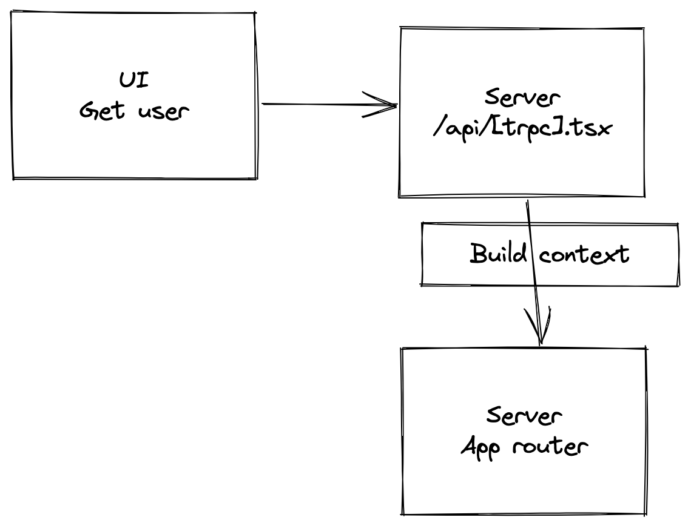

Overview:

This is a tRPC, TypeScript, Next.js, Prisma, Railway & Zod app That allows user to login and create blog post with end to end type safety. It's an extension of the TomDoesTech's building a t3 blog tutorial

Tutorial:
https://www.youtube.com/watch?v=syEWlxVFUrY&t=2770s


Extended:

I've extend the demos work by deploying the app and including Sendgrid to send user live emails to login. 


Running local
```sh
copy .env.example .env
## Add your own variables in .env
npm install
npm run dev
```


Digram


## Technologies used
* tRPC
* TypeScript
* Prisma (Postgres)
* Zod - Schema validation & type generation
* nodemailer - Sending OTP emails preview
* Sendgrid - Sending live OTP emails preview

## Features
* Register user
* Login with OTP
* Create a post
* View a post
* List posts


## Next steps:

1: Design: The current design is pretty bare bones, I'm planning on adding next-themes and redsigning all of pages

2: Like, Comment, and Subcribe... no really: I think being able to post is cool, but I'd be cooler if you could notified when a blogger you follow post something, or if you could comment on post, like on medium. Those are soe of the next steps. 

3: Auth updates: 
- There isn't a way to log out, that will be in later version 
- OTP isn't a bad auth option, but I'd like to extend it with something like Next Auth or a socail auth tool like Auth0.


